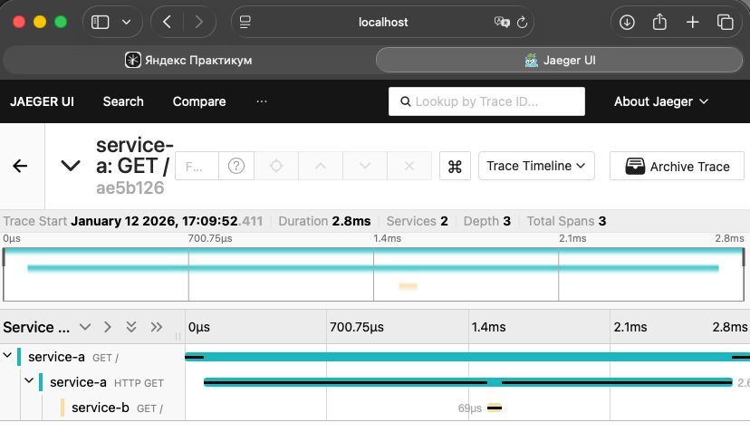

# Task3.1 — Go сервисы с OpenTelemetry + Jaeger в Kubernetes (MVP)

---

## Структура

```
  k8s/
    jaeger.yaml
    services.yaml
  services/
    service-a/
      main.go
      go.mod
      Dockerfile
    service-b/
      main.go
      go.mod
      Dockerfile
```

---

## 1) Поднять кластер (пример с minikube)

```bash
minikube start --driver=docker
kubectl get nodes
```

---

## 2) Развернуть Jaeger

```bash
kubectl apply -f k8s/jaeger.yaml
kubectl -n observability rollout status deploy/simplest
kubectl -n observability get svc
```

---

## 3) Собрать Docker-образы и загрузить в кластер

### Вариант minikube: использовать docker-env

```bash
eval $(minikube docker-env)

docker build -t service-a:latest services/service-a
docker build -t service-b:latest services/service-b
```

---

## 4) Задеплоить сервисы

```bash
kubectl apply -f k8s/services.yaml
kubectl rollout status deploy/service-b
kubectl rollout status deploy/service-a
kubectl get pods
```

---

## 5) Сгенерировать трейс (service-a вызывает service-b)

Временный pod с curl/wget:
```bash
kubectl run curl --rm -it \
--image=curlimages/curl \
--restart=Never -- sh
```
Внутри pod’а:
```bash
curl http://service-a:8080
```

Ожидаемый ответ:

```
service-a: ok -> called service-b
```

---

## 6) Открыть Jaeger UI

```bash
kubectl -n observability port-forward svc/simplest-query 16686:16686
```

в браузере: http://localhost:16686

### Как найти трейс
- В фильтре Service выбери `service-a`
- **Find Traces**

---

## 7) Скриншот



---