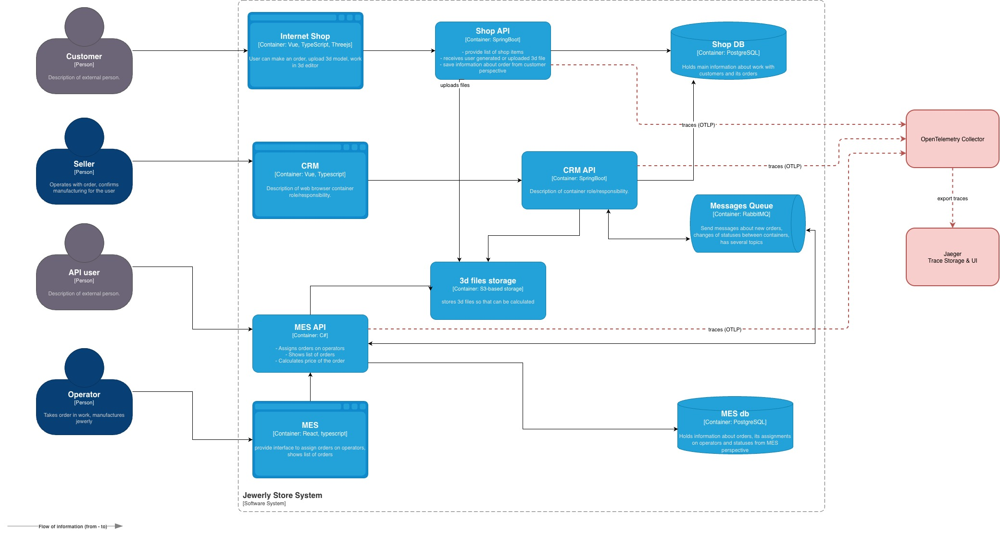
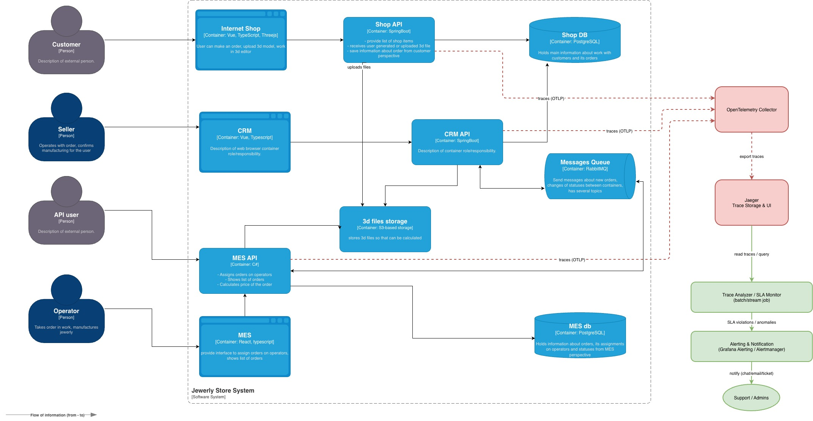

# Task3. Распределённый трейсинг
    ## Система «Александрит»

    > **Тип документа:** Архитектурное решение  
    > **Назначение:** end-to-end наблюдаемость жизненного цикла заказа  
    > **Основание:** анализ текущей архитектуры и выявленных проблем

    ---

    # Архитектурное решение по трейсингу в системе «Александрит»

## 1. Контекст и проблема

В распределённой системе «Александрит» заказ проходит через несколько сервисов:
- Online Shop API
- MES API
- CRM API
- RabbitMQ
- фоновые обработчики (расчёт цены, производство)

На текущий момент:
- невозможно быстро понять, **где именно «завис» заказ**;
- теряются сообщения или нарушается порядок обработки;
- разбор инцидентов занимает часы и дни;
- бизнес не понимает реальное время прохождения заказа.

Для решения этих проблем требуется внедрение **распределённого трейсинга**.

---

## 2. Мотивация

### 2.1 Для бизнеса
- Сокращение времени поиска причин просрочек заказов.
- Прозрачность жизненного цикла заказа (end-to-end).
- Повышение доверия B2B-партнёров.
- Снижение операционных потерь и SLA-штрафов.

### 2.2 Для инженерной команды
- Быстрая локализация проблем (API / очередь / БД).
- Понимание реального взаимодействия сервисов.
- Основа для автоматического мониторинга процессов.

### 2.3 Метрики, на которые влияет трейсинг
1. Mean Time To Detect (MTTD)
2. Mean Time To Resolve (MTTR)
3. Time-in-status заказа
4. % заказов с нарушенным SLA
5. Доля «потерянных» заказов

---

## 3. Зоны системы, покрываемые трейсингом

Трейсинг должен покрывать все точки, где заказ может:
- зависнуть,
- потеряться,
- обрабатываться слишком долго.

### Критические точки:
- Online Shop API → MES API (SUBMITTED → PRICE_CALCULATED)
- MES API → RabbitMQ → CRM API
- CRM API → RabbitMQ → MES API (MANUFACTURING_APPROVED)
- MES API → фоновые воркеры (расчёт цены, производство)
- Внешние B2B API вызовы

---

## 4. Данные, которые должны попадать в трейс

### 4.1 Обязательные атрибуты (span attributes)
- order_id
- correlation_id / trace_id
- service.name
- operation.name
- status (success / error)
- error.type / error.message
- duration

### 4.2 Бизнес-атрибуты
- order_type (b2b / b2c)
- current_status
- previous_status
- partner_id (для B2B)
- model_complexity / polygon_count_bucket

### 4.3 Очереди
- queue_name
- message_id
- retry_count

---

## 5. Предлагаемое решение

### 5.1 Технологический стек
- **OpenTelemetry** — стандарт для сбора трейсов
- **Jaeger** — хранение и визуализация трейсов
- **OTel Collector** — агрегация и маршрутизация данных
- **Kubernetes** — платформа исполнения (MVP)

### 5.2 Архитектура решения
1. Все API (Shop / CRM / MES) инструментируются OpenTelemetry SDK.
2. При входящем HTTP-запросе создаётся root-span.
3. TraceContext прокидывается:
    - через HTTP headers,
    - через сообщения RabbitMQ (message headers).
4. Фоновые воркеры продолжают трейс от сообщения.
5. Все трейсы отправляются в OpenTelemetry Collector.
6. Collector экспортирует данные в Jaeger.

### 5.3 Изменения в C4-диаграмме
- Добавлены компоненты:
    - OpenTelemetry Collector (красным)
    - Jaeger (красным)
- Добавлены связи:
    - API → OTel Collector
    - Collector → Jaeger

🔗 **Ссылка на обновлённую C4-диаграмму:**

---

## 6. Автоматический мониторинг и алертинг (дополнительно)

На основе данных трейсинга реализуется:
- агрегаты time-in-status,
- выявление заказов без активности > N минут,
- SLA-алерты.

### Новые компоненты:
- Trace Analyzer / Job SLA Monitor
- Alert Manager / Notification Service

Реакции:
- создание тикета,
- уведомление поддержки,
- автоматическое ограничение приёма новых B2B-заказов.

🔗 **Ссылка на обновлённую C4-диаграмму:**

---

## 7. Компромиссы и ограничения

- Трейсинг не заменяет корректную бизнес-логику.
- Старые заказы без trace_id не будут восстановлены.
- Высокая детализация трейсов увеличивает нагрузку и объём данных.
- Проприетарные внешние системы могут не поддерживать TraceContext.
- Для очередей требуется доработка продюсеров и консьюмеров.

---

## 8. Безопасность

- Jaeger UI доступен только из внутренней сети.
- Аутентификация через корпоративный SSO / VPN.
- Ограничение ролей (только поддержка и инженеры).
- Фильтрация PII из атрибутов трейса.
- Шифрование трафика между сервисами и Collector.

---

## 9. Вывод

Распределённый трейсинг:
- превращает «чёрный ящик» обработки заказов в прозрачный процесс;
- снижает операционные риски;
- является фундаментом для масштабирования и автоматизации.
