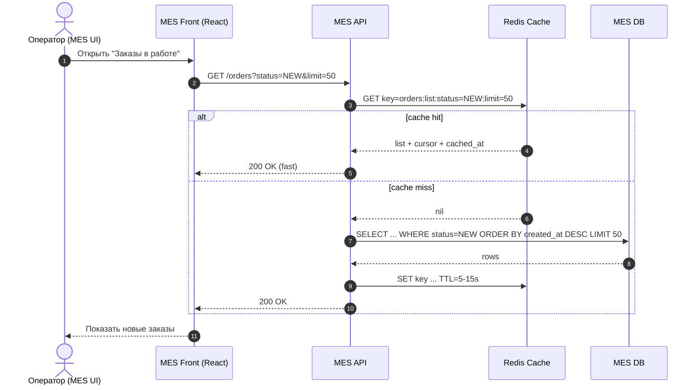
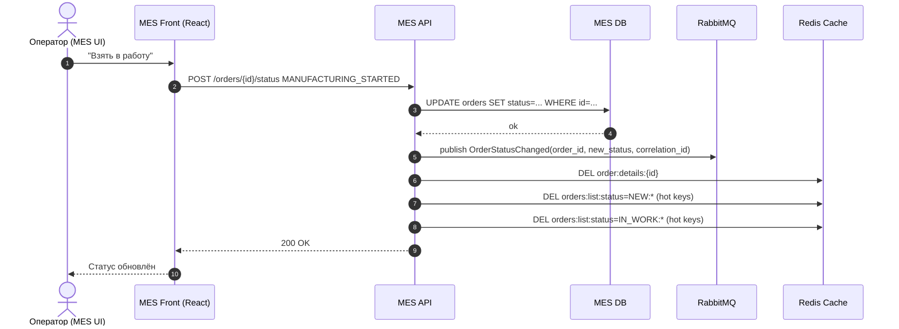

# Архитектурное решение по кешированию в системе «Александрит»

## 1. Контекст и проблема

MES испытывает деградацию:
- **операторы** жалуются на медленную загрузку первой страницы (дашборд/список заказов «в работе» по статусам);
- **новые клиенты** (B2B и B2C) недовольны сроками выполнения заказа (особенно этапом **расчёта стоимости** 2–30 минут);
- фильтрация по статусам и пагинация в UI **не помогли**, значит узкое место скорее всего на стороне:
  - чтения из БД (агрегации/сортировки/индексы),
  - «тяжёлой» read-модели дашборда,
  - конкуренции запросов (операторы + API + фоновые процессы).

Задача кеширования в этом задании — **ускорить наиболее частые и критичные чтения**, уменьшить нагрузку на БД и сделать время ответа предсказуемым.

---

## 2. Что именно имеет смысл кешировать

Кешировать стоит **read-heavy** части, где:
- много повторяющихся запросов,
- важны быстрые ответы,
- данные меняются часто, но допустима *лёгкая* “stale”-свежесть (секунды).

### 2.1 В MES (приоритет №1)
1) **Список «самых новых заказов» по статусам** (главная страница MES)  
   - запросы частые, одни и те же фильтры (например: `NEW/QUEUED/APPROVED/IN_WORK`, сортировка по `created_at desc`).
2) **Счётчики по статусам** (агрегации)  
   - «сколько заказов в статусе X», «сколько новых за последние N минут».
3) **Карточка заказа (order details) для повторных открытий**  
   - операторы часто открывают один и тот же заказ, меняют статус, возвращаются назад.

### 2.2 Межсервисные данные (второй этап)
4) **Результат расчёта цены / статус расчёта** (pricing job status/result)  
   - не кешировать «сам расчёт», а кешировать **результат и прогресс** (job state), чтобы не ходить в БД/хранилище лишний раз и быстро отвечать Shop/B2B.

> Важно: кеширование **не заменяет** оптимизацию запросов и индексы. Кеш — это ускоритель и предсказуемость ответа, но источник истины остаётся в БД.

---

## 3. Мотивация

### 3.1 Почему кеширование нужно бизнесу
- **Снижение времени обработки заказа** за счёт ускорения «операторского цикла» (быстрее увидели новый заказ → быстрее взяли в работу).
- **Снижение числа просрочек**: меньше задержек на стадии «взять заказ».
- **Повышение удовлетворённости B2B**: меньше ожиданий на запросах статуса/результата.
- **Снижение стоимости инфраструктуры**: разгружаем БД и уменьшаем давление на один инстанс.

### 3.2 Какие проблемы решает
- Медленная загрузка первой страницы MES из-за тяжёлых запросов/агрегаций.
- Высокая нагрузка на MES DB при росте числа заказов и операторов.
- «Шторм» одинаковых запросов от нескольких операторов (и/или автообновления UI).

### 3.3 Что включаем в кеширование
- Server-side кеш **для read-path** MES (списки и счётчики).
- Кеш статуса/результата расчёта цены (job status/result) как быстрый слой чтения.

---

## 4. Предлагаемое решение

### 4.1 Тип кеширования: серверное (основное) + клиентское (вспомогательное)

**Почему серверное — основное:**
- проблема на стороне MES и БД, клиентский кеш не решит тяжёлые агрегации и нагрузку;
- серверный кеш обеспечивает единый контроль TTL/инвалидации и одинаковое поведение для всех клиентов (операторы, API).

**Клиентское (дополнительно, не вместо):**
- HTTP caching (ETag/If-None-Match) для `GET /orders/{id}` при частых повторах,
- локальный кеш состояния UI (React query cache) на секунды, чтобы не делать «дубликаты» запросов при навигации.

### 4.2 Компоненты
- **Redis** (managed) как распределённый кеш (низкая задержка, TTL, pub/sub при необходимости).
- MES API дополняется слоем кеширования:
  - Cache keys по фильтрам + курсору пагинации,
  - хранение счётчиков по статусам,
  - хранение карточки заказа на короткий TTL.

### 4.3 Паттерн кеширования

#### Для чтения списков/счётчиков (главная страница MES): **Cache-Aside + Refresh-Ahead (гибрид)**
- **Cache-Aside**: при запросе сначала проверяем кеш, при miss — читаем из БД и кладём в кеш.
- **Refresh-Ahead**: для самых популярных ключей (например, «NEW», «IN_WORK») делаем фоновое обновление, чтобы минимизировать miss и избежать «пилообразной» нагрузки.

Почему так:
- Cache-Aside проще в реализации и безопаснее (БД — источник истины).
- Refresh-Ahead нужен, потому что операторам критично видеть “почти real-time”, а постоянные miss на TTL создадут пики.

Почему **не Write-Through**:
- Write-Through хорош, когда каждое изменение данных должно сразу попадать в кеш, но:
  - статусы меняются часто,
  - есть конкурирующие записи (воркеры, операторы, интеграция),
  - риск усложнить транзакционность (БД + кеш) и увеличить latency записи.

Почему **не чистый Refresh-Ahead везде**:
- дорого обновлять все возможные комбинации фильтров/страниц;
- эффективен только для «горячих» ключей.

#### Для карточки заказа: **Cache-Aside**
- частые повторные чтения одной карточки;
- инвалидация по ключу при смене статуса/изменении полей.

#### Для статуса/результата расчёта цены: **Cache-Aside + программная инвалидация**
- воркер по завершении расчёта записывает результат в БД и **обновляет/инвалидирует** соответствующий ключ в Redis.

---

## 5. Диаграммы последовательности (Sequence diagram)

Ниже диаграммы в формате Mermaid (их можно вставить в Markdown/Confluence).

### 5.1 Чтение списка заказов (оператор открывает главную страницу)

### 5.2 Запись: изменение статуса заказа (оператор берёт заказ в работу)

> Для больших наборов ключей по статусу предпочтительнее не «DEL по маске», а **версионирование ключей** (см. инвалидацию ниже).

---

## 6. Стратегия инвалидации кеша

### 6.1 Требования
- Операторам важны **самые новые заказы** (почти real-time).
- Заказы часто меняют статус.
- Нельзя допустить, чтобы кеш показывал «очень старые» данные.

### 6.2 Комбинированная стратегия (рекомендуется)

1) **Короткий TTL** для списков/агрегаций: 5–15 секунд  
   - гарантирует, что даже без событий мы не будем показывать старьё долго.

2) **Программная инвалидация по событию** при смене статуса  
   - при любом `OrderStatusChanged`:
     - инвалидация `order:details:{id}`
     - инвалидация «горячих» списков (NEW/IN_WORK/APPROVED) через версионирование ключей.

3) **Версионирование ключей (cache key versioning)** для списков
- Храним в Redis счётчик-версию для группы ключей:
  - `v:orders:list:status:NEW = 42`
- Ключ списка строим так:
  - `orders:list:status=NEW:v=42:limit=50:cursor=...`
- При изменении статуса:
  - инкрементируем версию `INCR v:orders:list:status:NEW` (и/или IN_WORK)
- Старые ключи «умирают» сами по TTL и не мешают.

Почему это лучше, чем удаление по маске:
- DEL по маске дорого и небезопасно при больших объёмах;
- версионирование O(1) и хорошо работает при росте нагрузки.

### 6.3 Сравнение стратегий инвалидации

| Стратегия | Плюсы | Минусы | Где применяем |
|---|---|---|---|
| TTL-only (временная) | простота, нет интеграции с событиями | данные могут быть stale до TTL, возможны пики miss | второстепенные данные |
| Инвалидация по ключу | точность, быстро | сложно, если много ключей по фильтрам/страницам | order details |
| Инвалидация «по маске» | кажется просто | плохо масштабируется, дорого | **не рекомендуем** |
| Версионирование ключей | быстро, масштабируется, без масок | нужна дисциплина ключей/версий | списки/дашборды |
| Refresh-Ahead | минимизирует miss | нужно выбрать «горячие» ключи, есть фоновые задачи | NEW/IN_WORK списки |

---

## 7. Дополнительное: варианты решений и выбор

### Вариант 1 (рекомендуемый): Redis + Cache-Aside + key versioning + короткий TTL
**Плюсы**
- Быстрый MVP и быстрый бизнес-эффект.
- Масштабируемая инвалидация.
- Минимальные изменения в доменной логике.

**Минусы**
- Данные на 5–15 секунд могут быть stale.
- Нужно следить за ключами и ретеншеном.

### Вариант 2: Отдельная read-модель (CQRS light) + материализованные представления/таблица
**Идея**
- В БД иметь «сводную таблицу дашборда» по статусам и новым заказам.
- Обновлять по событиям `OrderStatusChanged`.

**Плюсы**
- Почти всегда консистентно и быстро (особенно если read-replica).
- Меньше зависимости от кеша.

**Минусы**
- Дороже в разработке и сопровождении.
- Нужно аккуратно проектировать обновления и конкуренцию.

### Сопоставление

| Параметр | Решение 1: Redis кеш | Решение 2: CQRS light |
|---|---|---|
| Скорость внедрения | высокая | средняя/низкая |
| Масштабирование | хорошее | хорошее, но сложнее |
| Консистентность | eventual (секунды) | ближе к strong (зависит от реализации) |
| Риск ошибок | средний | выше (больше логики) |
| Стоимость эксплуатации | низкая/средняя | средняя |

**Заключение:** для «Александрита» на горизонте 3–6 месяцев оптимально начать с **Redis + Cache-Aside + versioning + TTL**, параллельно измеряя эффект и готовя более устойчивую read-модель (CQRS light) при дальнейшем росте.

---

## 8. Риски и меры контроля

- **Риск устаревших данных:** короткий TTL + инвалидация по событию.
- **Кеш-шторм при истечении TTL:** jitter TTL + refresh-ahead для горячих ключей.
- **Рост памяти Redis:** лимиты, eviction policy (allkeys-lru), наблюдаемость hit rate.
- **Ошибки в логике ключей:** единый модуль/библиотека ключей и тесты.

---

## 9. Ожидаемый эффект

- Главная страница MES: снижение latency (p95) в разы за счёт cache hit.
- Снижение нагрузки на MES DB (меньше тяжёлых SELECT и агрегаций).
- Ускорение взятия новых заказов операторами → сокращение time-to-start manufacturing.
- Более предсказуемый throughput при росте заказов.
